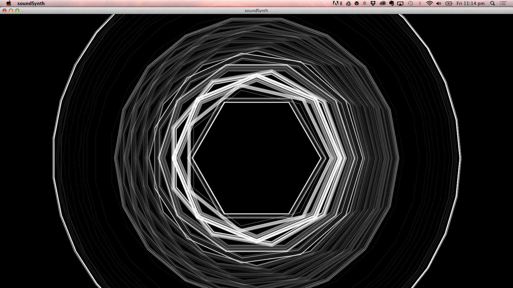

######This is an arduino / processing project for making a one button synth that is also a drawing machine. 

It makes stuff that looks like this 
	

The audio output is crunchtastic analog 

There's also a little pdf hanging out in this repo. It's the notes for the workshop. 